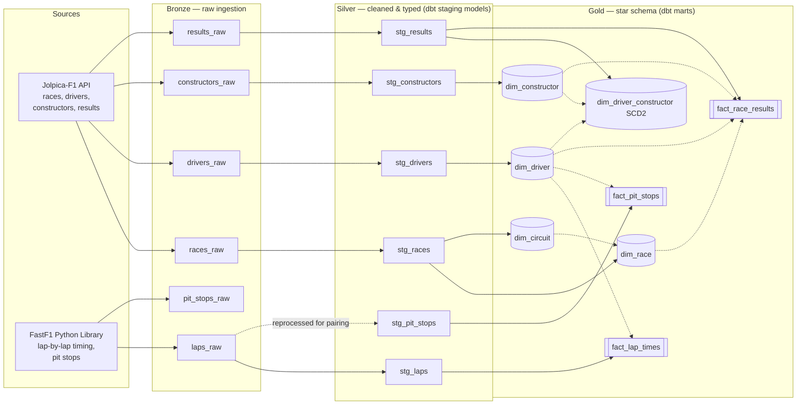
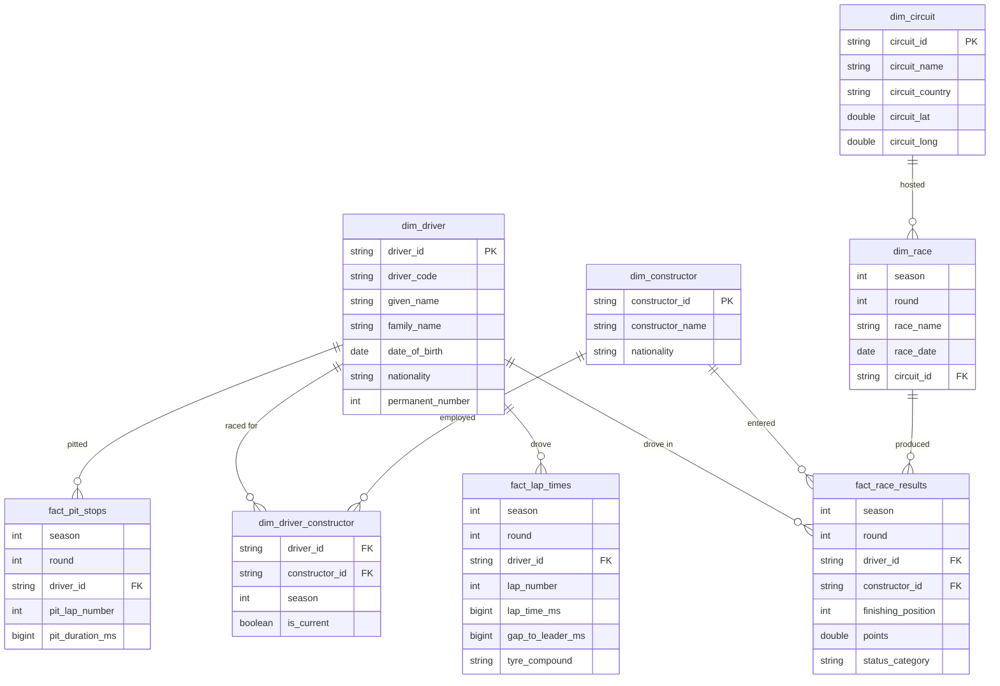

# A dimensional warehouse for Formula 1

## The Problem

Formula 1 produces an enormous amount of data every single race weekend lap times, pit stops, sector splits, tyre strategies, driver and constructor histories spanning decades. Yet almost all of it lives in a shape that's useless for real analysis: nested JSON blobs from APIs, lap times stored as literal strings like `"0 days 01:42:58.065000"`, missing values disguised as the text `"NaT"`, and pit stop events split across two unrelated rows of data with no obvious way to reconnect them.

If you tried to answer a simple question: *"how consistent was a driver's pace across a season?"* or *"how long did a pit stop actually take?"* directly against this raw data, you'd hit a wall almost immediately. The data isn't wrong; it's just not *modeled*. It describes events, but it doesn't describe relationships, grain, or history in a way a database or a person can reason about.

This project exists to solve that problem properly: not by writing one-off scripts to answer one-off questions, but by building a real, tested, documented dimensional warehouse, the same kind of foundational data engineering work that sits underneath every serious analytics or BI system, applied to two full seasons of Formula 1 (2023–2024).

## The Solution

A complete medallion-architecture pipeline: **bronze → silver → gold**, built on Databricks with Unity Catalog, transforming raw API data into a clean, tested, dimensionally modeled star schema using dbt.

By the end of the pipeline:
- **46 races**, **26 unique drivers**, **11 constructors**, **919 individual race results**, **50,078 individual laps**, and **3,400+ pit stops** are fully modeled
- A driver's team history is tracked correctly across mid-season changes (an SCD2-style dimension)
- Real, derived metrics, gap-to-leader per lap, true pit stop duration exist that never existed in the raw source data at all
- **39 automated data quality tests** guard the integrity of every join and constraint in the model

## Architecture



## The Star Schema



## Why This Tech Stack

**Databricks + Unity Catalog + Delta Lake** — chosen specifically to work around a real hardware constraint: this project was built entirely on a 4GB RAM machine, which cannot comfortably run local Spark, local Airflow, or even a local dbt-DuckDB setup at any real scale. Every ingestion script, every dbt model, and every test runs on Databricks' cloud compute — the local machine only ever renders a browser tab. Unity Catalog provides governed, three-level namespacing (`catalog.schema.table`) and was used deliberately, not just for governance's sake, but to establish a real bronze/silver/gold separation as physically distinct schemas, not just a folder-naming convention.

**dbt (dbt-databricks)** — the core reason dbt exists in this project, rather than continuing with hand-written PySpark transformations, is that dimensional modeling is fundamentally a *transformation and testing* problem, not a compute-engineering problem. dbt gives three things PySpark scripts don't provide out of the box: (1) a dependency graph (`ref()`) that automatically sequences models correctly, (2) a declarative testing framework (`schema.yml`) for uniqueness, referential integrity, and value constraints, and (3) auto-generated documentation and lineage. Writing the same guarantees by hand in PySpark would mean re-inventing dbt's core value proposition from scratch.

**Python (requests, FastF1)** — used purely for ingestion, where an imperative script genuinely is the right tool: hitting a REST API, or driving a purpose-built scraping library like FastF1, isn't a SQL problem.

**GitHub + Databricks Repos** — version control lives in GitHub as normal, but all editing and execution happens through Databricks' Git-integrated Workspace folders, so code is properly tracked without ever touching local disk.

## Data Engineering Concepts Demonstrated

- **Medallion architecture** — bronze (raw, unprocessed), silver (cleaned, typed, flattened), gold (business-ready, dimensionally modeled), with each layer serving a distinct, deliberate purpose rather than being an arbitrary folder split.
- **Grain** — the single most important modeling decision made explicit: `fact_lap_times` is defined at *one driver, one lap, one race* — coarse enough to be tractable, fine enough to support real strategy analysis, and deliberately rejecting full telemetry as a grain that would turn this into a time-series engineering problem rather than a modeling one.
- **Star schema design** — fact tables holding measures (lap times, points, pit durations) surrounded by dimension tables holding descriptive context (driver bios, constructor names, circuit locations), joined via foreign keys rather than duplicating descriptive data across every fact row.
- **Slowly Changing Dimensions (SCD Type 2)** — `dim_driver_constructor` tracks which team a driver raced for, at season grain, explicitly handling real-world team changes (e.g., a driver moving between constructors from one season to the next) without silently overwriting history. The grain of this table was a deliberate choice: season-level validity windows, rather than fabricated exact transfer dates the source data doesn't actually support.
- **Data quality testing** — 39 dbt tests covering primary key uniqueness, not-null constraints, referential integrity (`relationships` tests confirming every foreign key in a fact table resolves to a real dimension row), and value-domain constraints (`accepted_values` on race status categories).
- **Idempotent, declarative transformations** — every silver and gold model is a dbt SQL `SELECT`, not an imperative script; re-running the pipeline produces the same result deterministically.
- **DRY transformation logic via macros** — a custom `parse_timedelta_ms` macro centralizes the (non-trivial) regex logic for converting `"0 days 01:42:58.065000"`-style strings into millisecond integers, used identically across both `stg_laps` and `stg_pit_stops` rather than duplicated.
- **Data lineage and documentation** — `dbt docs generate` produces a full interactive lineage graph and column-level data dictionary directly from the models and `schema.yml`, rather than documentation living separately from the code it describes.

## Engineering Decisions & Real Problems Solved

**FastF1's cache silently failing on cloud storage.** FastF1 caches API responses locally using SQLite but SQLite requires real file-locking, which Unity Catalog Volumes (FUSE-mounted cloud storage) don't support. This surfaced as a confusing cascade of "schedule backend failed" warnings that had nothing to do with the network. The actual fix: redirect FastF1's cache to the compute node's local ephemeral disk (`/local_disk0`) instead of a Volume still entirely within Databricks' cloud compute, never touching a local machine, just not using Unity Catalog storage for this one ephemeral cache.

**Pit stops split across two rows.** A pit stop's entry and exit timestamps don't live on the same row — because "lap" is defined by crossing the start/finish line, and the pit lane physically spans that boundary, a pit-in event is recorded on one lap and the corresponding pit-out event on the next. Fixed using a `LEAD()` window function, partitioned by driver and race, to pull the following lap's exit time back onto the entry row before computing true pit duration.

**A schema-name doubling bug.** dbt's default schema-naming behavior concatenates the target schema with any custom `+schema` config, silently producing `silver_silver` instead of `silver`. Fixed with a `generate_schema_name.sql` macro override a standard, well-known dbt pattern for exactly this situation.

**A leaked credential.** A Databricks personal access token was briefly committed to the public GitHub repo despite a `.gitignore` entry — because `.gitignore` only prevents *future* tracking, not retroactive removal of an already-committed file. Resolved by immediately revoking the token, removing the file from git tracking, and regenerating credentials — a real (if uncomfortable) lesson in the difference between "ignored going forward" and "actually removed."

**Deliberately relaxed data test.** `fact_pit_stops.pit_duration_ms` has 58 legitimate null values — not a data defect, but real events (a driver retiring while still in the pits, or pitting on the final lap with no recorded out-lap) where a duration genuinely cannot be calculated. The `not_null` test was deliberately removed for this column after investigation confirmed the nulls were explainable, not erroneous — a reminder that a passing test suite should reflect the truth of the data, not force every column into an assumption that doesn't hold.

## Project Structure

```
f1-data-modeling/
├── ingestion/
│   ├── fetch_jolpica.py      # Races, drivers, constructors, results
│   └── fetch_fastf1.py        # Lap-by-lap timing, pit stops
└── dbt_project/
    ├── dbt_project.yml
    ├── macros/
    │   ├── parse_timedelta_ms.sql
    │   └── generate_schema_name.sql
    └── models/
        ├── staging/           # Silver layer — one model per bronze source
        └── marts/              # Gold layer — star schema + tests
```

## Tech Stack

Python · Databricks (Delta Lake, Unity Catalog) · dbt (dbt-databricks) · SQL · Jolpica-F1 API · FastF1

## Data Sources

- [Jolpica-F1](https://api.jolpi.ca/ergast/f1/) — the community-maintained successor to the (now-retired) Ergast API
- [FastF1](https://docs.fastf1.dev/) — Python library for official F1 timing and telemetry data
